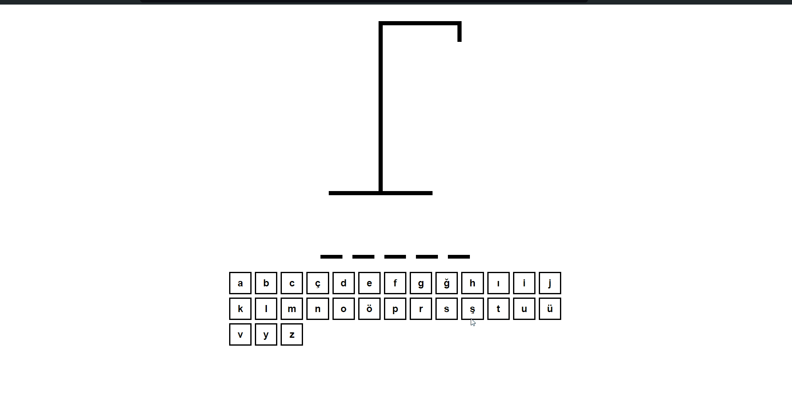

# Hangman with TypeScript

<div align="center">
  
</div>

## About the Project

This project is a Hangman game built using React and TypeScript. Players try to guess the word while avoiding completing the hangman figure with incorrect guesses. The game ends when the player either correctly guesses the word or makes too many incorrect guesses.

## Table of Contents

- [Features](#features)
- [Technologies Used](#technologies-used)
- [Usage](#usage)
- [Project Skeleton](#project-skeleton)

## Live Demo

[Hangman with TypeScript](https://hangman-with-typescript.vercel.app/)

## Features

- Random word selection
- Tracking of guessed and incorrect letters
- Win and lose conditions
- Letter guessing via keyboard or on-screen virtual keyboard
- Ability to restart the game

## Technologies Used

- React
- TypeScript
- Vite

## Usage

- When the game starts, a random word is selected.
- Guess letters using your keyboard or the on-screen virtual keyboard.
- Each incorrect guess will add a part to the hangman figure.
- The game is lost if 6 incorrect guesses are made. The game is won if the correct word is guessed.
- Press the Enter key to restart the game.

## Project Skeleton

```
Hangman with TypeScript (folder)
│
├── public
│    └── [favicon]
├── src
│    ├── assets
│    │     └── [images]
│    ├── components
│    │     ├── HangmanDrawing.tsx
│    │     ├── HangmanWord.txs
│    │     └── Keyboard.tsx
│    ├── assets
│    │     └── Keyboard.module.css
│    ├── App.tsx
│    ├── main.tsx
│    ├── vite-env.d.ts
│    └── wordList.json
├── .eslintrc.cjs
├── .gitignore
├── index.html
├── package-lock.json
├── package.json
├── README.md
├── tsconfig.app.json
├── jsconfig.json
├── jsconfig.node.json
└── vite.config.ts
```